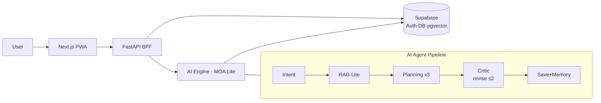

# Dreammate Studio
## 영상기획 AI 에이전트 — 중간 발표

[발표자 이름] · 2026-06-07

> 영상 아이디어를 **브랜드 방향 · 기획안 · 실행계획(WBS)** 으로 바꾸는 AI 에이전트

---

## 1. 문제 정의

- 영상 **제작** 도구는 많다 (CapCut, Runway) — 부족한 건 **기획의 품질**
- 1인 마케터·소규모 브랜드의 고통:
  - 영상 1편 기획에 **2~4시간**, 브랜드 톤 일관성 유지 어려움
  - 범용 LLM은 영상 도메인이 얕고 **매번 처음부터**

> **한 줄 가치 제안**
> 막연한 영상 아이디어를 → 브랜드 방향 · 타깃 · 메시지 · 기획안 · WBS 까지 연결한다.
> **"더 잘 만든다"가 아니라 "쓸수록 내 브랜드에 맞춰진다."**

---

## 2. 사용자 시나리오

> **김지영 (1인 향수 브랜드 마케터)** 가 처음 가입해서 첫 기획을 만든다.

1. 브랜드 정보 없음 → **Discovery 위저드** 5단계 카드 (AI 추천 4 + 직접입력 1)
2. 브랜드 → 도메인(뷰티) → 시리즈(신상 리뷰) → 타깃 → 톤
3. AI가 **"한 줄 기획 방향"** 제안 → 사용자 승인
4. 30~60초 → **기획안 후보 3개** → 1개 선택 + 피드백
5. 다음부터는 **Quick 모드** (한 줄 + 1~2 질문) — 누적 컨텍스트 재사용

*(스크린샷 / GitHub Pages 데모 화면 1장)*

---

## 3. 기술 스택과 아키텍처 (왜 선택했나)

| 영역 | 선택 | 이유 |
|---|---|---|
| 프론트 | Next.js 14 PWA | 모바일 타깃 · 설치 불필요 · 빠른 반복 |
| 백엔드 | FastAPI (Python) | AI/RAG 생태계와 같은 언어로 통합 |
| 데이터 | Supabase (Postgres + pgvector) | Auth · DB · 벡터검색 한 곳 (1인 부담 ↓) |
| LLM | gpt-4o-mini 기본 / 상위 모델 검증 | 비용 — 생성은 싸게, 검증만 비싸게 |
| 멀티모델 | LLM Gateway (OpenAI·Claude·Gemini) | 단일 모델 종속 회피 |

> 모든 결정은 ADR 문서로 추적 가능.

---

## 4. 아키텍처 다이어그램

---

## 5. 진행 상황 — 정직하게

> **자체 진단: 코드 完成度 高 · 실사용 운영 中 · 품질 검증 弱**

- ✅ **완료**: MOA 파이프라인 · RAG 5단계 · Critic 재작성 · 3-provider Gateway · 회원가입/로그인 · 4계층 데이터 · 피드백/메모리 — **pytest 814 · API 30 · PWA 14 라우트**
- ✅ **라이브 검증(PASS)**: 실 LLM으로 **director 기획안 3개 생성 + Supabase 영속(재시작 유지)**
- 🚧 **진행**: 핵심 기능 기본 OFF → "실사용 프로파일" 단일 스위치로 마감 · 프론트 시각 고도화
- ⏳ **예정**: 실-런 5~10명 · 사람 품질 채점 · 배포 Gate

전체 진척: **약 65%** (1차 MVP 실사용 마감 기준)

---

## 6. 데모

> 기본 = **GitHub Pages 대시보드 + 라이브 검증 증거**, 시간 되면 실 앱 라이브

준비된 시나리오:
1. 대시보드: 문제 → 해결 흐름 → 아키텍처 → **WBS 진척**
2. 라이브 PASS 증거: 실 gpt-4o-mini director 기획안 3개 + plans 테이블 영속
3. (옵션) 실사용 프로파일로 홈 → 생성 → 저장 → 내 brain

> **백업**: 30초~1분 데모 영상 + 스크린샷 (사고 시 즉시 전환)

---

## 7. 남은 일정

| 시점 | 목표 |
|---|---|
| 다음 | 프론트 "에이전트 느낌" UX 고도화 |
| 그 다음 | 실-런 검증 — 5~10명 + **사람 품질 채점** |
| 이후 | 2차 MVP + 배포 Gate (rate limit · 운영 인프라) |
| CI 보강 | GitHub Actions에 pytest 자동화 (현재 Pages 배포 CI만) |

> 우선순위 원칙: **"코드는 됐으니, 사람이 써보고 품질을 검증한다."**

---

## 8. 어려운 점 / 배운 것

- ★ **"자동 통과 ≠ 실제 동작"** — 테스트는 전부 green인데, 실 DB 저장은 컬럼 불일치로 실패. 라이브에서 처음 발견 → 직접 수정.
- **"만들었는데 안 보인다"** — 안전하게 기본 OFF로 넣다 보니 사용자가 못 씀 → 단일 스위치로 마감.
- **AI 활용 솔직성** — 초안은 AI, **범위 판단·검토·동작 검증은 사람**이 책임. (쿠키 secure 버그, 422 메시지, 영속 스키마 직접 수정)

---

## 9. 질문 받습니다

> **Dreammate Studio**
> 영상 아이디어를 브랜드 전략과 실행 계획으로 바꾸는,
> **쓸수록 내 브랜드를 학습하는** 영상기획 AI 에이전트.

- 발표 사이트: GitHub Pages (`docs/index.html`)
- 함께 보기: `docs/setup.md` · `docs/presentation/qna-prep.md`

감사합니다 🙏
